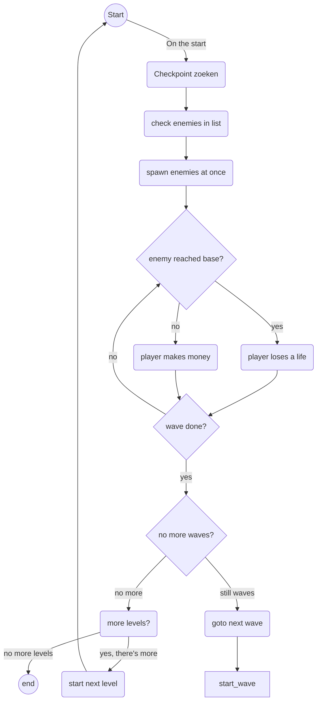
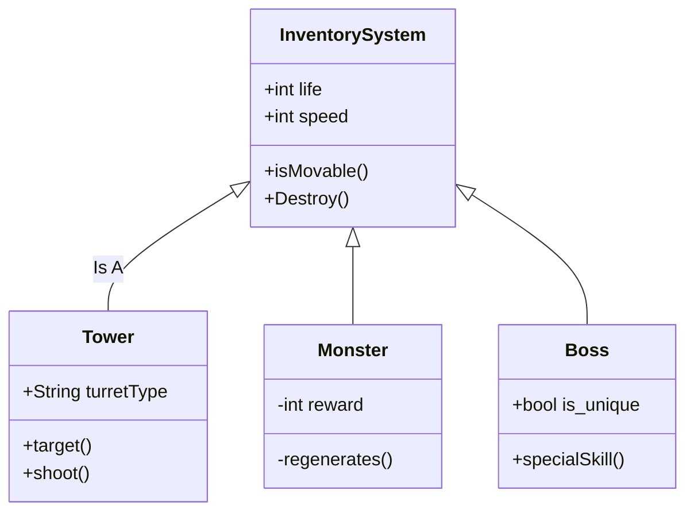

# Survival Of The Fallen

#### Het idee van de game is:

Een first person survival game waarmee je doormiddel van materialen verzamelen, wapens en voorwerpen kan creeëren om jezelf en je basis te beschermen. Waarbij je doormiddel van een levelsysteem op een hogere wereld kan komen waar je nieuwe en meer zeldzamere materialen kan verzamelen. Maar de vijanden in die hogere werelden hebben ook meer hp waardoor je dus voorzichtig moet gaan spelen.

# Geproduceerde Game Onderdelen

  * [Scriptable Guns Script](https://github.com/mennoweerman/SurvivalOfTheFallen/blob/main/Assets/Scripts/Scriptable%20Objects/GunData.cs)
  * [Enemy Behavior](https://github.com/mennoweerman/SurvivalOfTheFallen/blob/main/Assets/Scripts/Enemy/EnemyAI.cs)
  * [Inventory System (WIP)](https://github.com/mennoweerman/SurvivalOfTheFallen/blob/Development/Assets/Scripts/Inventory%20Scripts/InventorySystem.cs)

## Scriptable Guns

Ik heb scriptable object gebruikt omdat dat ik dan snel gegevens van de wapens kan opslaan en opvragen. Scriptable objects zijn vooral handig aangezien je meerdere instanties van een object kan maken met dezelfde variabelen. De variablen die ik heb gebruikt zijn: De naam van het geweer, hoeveel schade het wapen doet, de maximale afstand die het wapen kan schieten, hoeveel kogels het wapen op dat moment  heeft, het maximaal aantal kogels van het wapen, hoe snel het wapen schiet en hoe lang het duurt voordat het wapen herladen is. Dus doormiddel van scriptable objects kan ik met een paar klikken een wapen aanmaken en gebruiken.

## Enemy Behavior

De enemy wordt met een "hoofd" script waarin staat wanneer de vijand welk gedrag vertoont, want de vijand heeft 3 soorten gedrag. De 3 soorten gedrag zijn: 

* Patrolling state, de vijand loopt naar random checkpoints toe om het gebied te verkennen.
* Chasing state, de vijand achtervolgt de vijand achtervolgt de speler net zolang totdat hij binnen de Attack range is of dat hij buiten het zicht is van de vijand.
* Attacking state, als de vijand binnen de Attack range is dan word geactiveerd dat de speler schade krijgt om een bepaald aantal seconden totdat de vijand dood is of totdat de speler uit de Attack range is.

## flowchart voor Enemy Wave Systeem:

## Inventory System

Het Inventory Systeem werkt dat je items kan oppakken en verwijderen. Maar je kan doormiddel van kisten je items/wapens opslaan en later weer uit de kisten halen. Als speler heb je zelf ook een inventory en een hotbar, waarin je dus de items kan zien, pakken en laten vallen op de grond. De items kan je zelf verzamelen of kopen vanuit een winkel. Die je vervolgens kan gebruiken om je wapens of je schip kan upgraden, waarbij de zeldzame materialen worden verdedigt door sterkere en meer schade aandoenende vijanden.

## Class diagram voor Inventory System:

